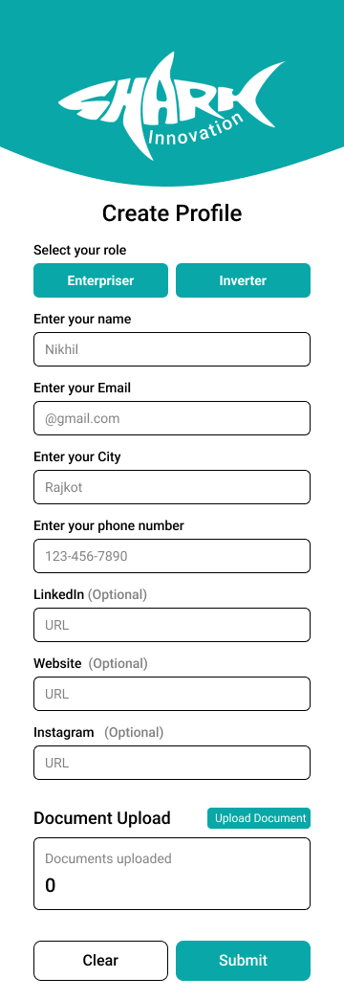
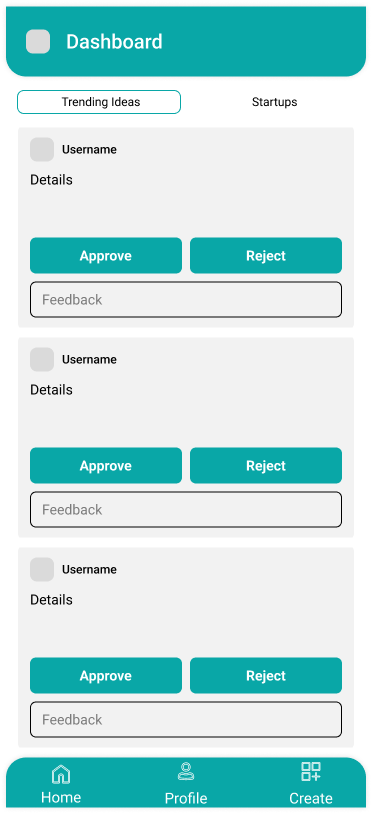
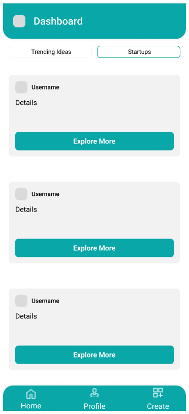
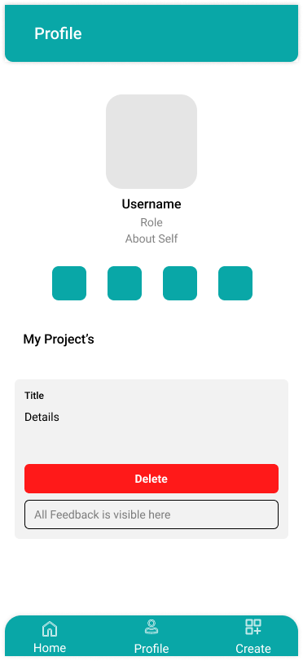
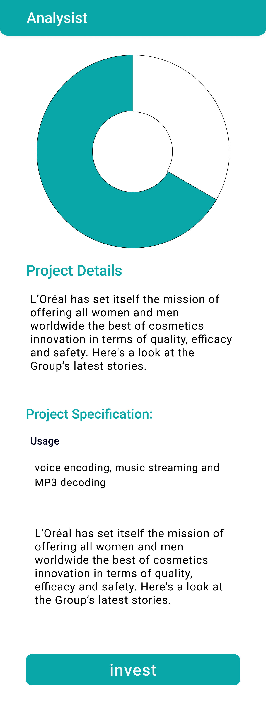

# Shark innovation

Shark Innovation is a cross-platform Flutter application designed to connect visionary entrepreneurs with startup ideas to investors seeking new opportunities. The app facilitates networking, idea evaluation, collaboration, and streamlined investment processes.

---

## ✨ Features

- 🔐 Dual Authentication (Entrepreneur / Investor)
- 🧠 Startup Posting & Descriptions
- 💸 Investment & Approval System
- 📈 Performance & Progress Tracking
- 👤 User Profile & Project Dashboard

---

## 🧭 App Flow Diagram

Visual representation of the Shark Innovation user journey and screen flow:

<p align="center">
  
</p>

---

## 🎨 UI / UX Screens

### 🔹 Splash & Authentication

| Splash Screen | Login Screen | Register Screen |
|---------------|--------------|-----------------|
|  |  |  |

### 🔹 Verification Flow

| Email Verification | OTP Screen |
|--------------------|------------|
|  |  |

### 🔹 Dashboard & Project Views

| Dashboard | Dashboard (Alt) | Project Details |
|-----------|------------------|-----------------|
|  |  |  |

### 🔹 Profile, Upload & Analytics

| Profile | Upload Post | Analytics |
|---------|-------------|-----------|
|  |  |  |


---

## 🛠️ Tech Stack

- **Frontend**: Flutter (Dart)
- **Database**: PostgreSQL
- **IDE**: VS Code

---

## 🚀 How to Run the App

```bash
git clone https://github.com/your-username/shark-innovation.git
cd shark-innovation
flutter pub get
flutter run
